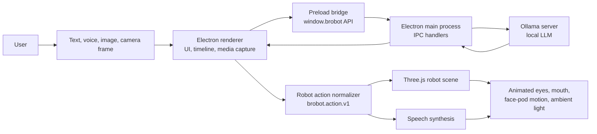
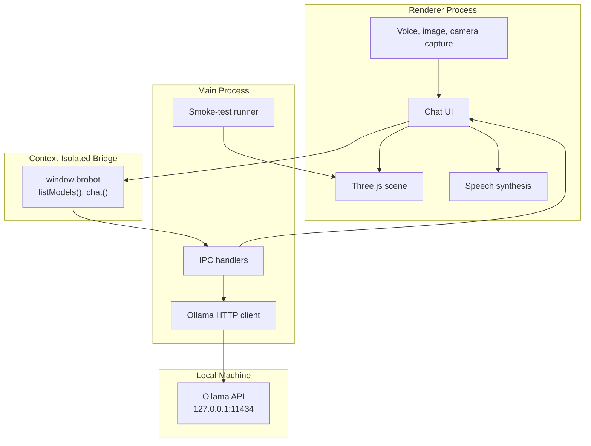
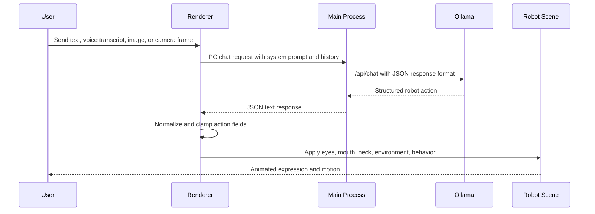
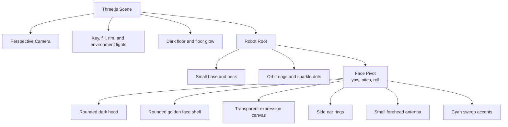

# Brobot Companion Lab

Brobot Companion Lab is a local-first desktop prototype for an expressive AI companion robot. It combines an Electron app shell, a Three.js animated face pod, and structured LLM output from Ollama to turn natural language and media input into visible personality: eyes, mouth, neck motion, voice tone, and ambient lighting.

The project is intentionally designed as a simulation-first robotics lab. The app can run entirely on a laptop, while the control schema is shaped so the same LLM output could later drive physical displays, motors, lights, and speakers.

## Why This Project Exists

Most chat apps stop at text. Brobot explores a more embodied interaction model:

- The LLM does not just answer. It directs a character.
- The UI does not just display messages. It renders expression, attention, and mood.
- The robot behavior is not hardcoded per phrase. It is controlled by a structured action contract.
- The architecture is local-first, so development can happen without a cloud dependency.

For a recruiter or reviewer, this project demonstrates product thinking, applied LLM integration, desktop app architecture, real-time 3D rendering, prompt/schema design, and a testable local development workflow.

## Current Features

- Electron desktop app with a secure preload bridge.
- Vite renderer with a responsive tool surface.
- Three.js 3D robot face pod with:
  - rounded dark hood
  - golden face shell
  - sleepy red/orange eyes
  - animated mouth
  - small antenna detail
  - side ear rings
  - cyan/orange ambient orbit lighting
- Rich motion vocabulary for the face pod:
  - idle breathing
  - nod, shake, bounce, nuzzle
  - shy sway, excited wiggle, startle pop
  - sleepy drift, lean in, lean back
  - curious loop and listen scan
- Ollama chat integration through the Electron main process.
- Text input, image upload, voice dictation when available, speech output, and low-fps camera snapshots.
- Structured JSON action schema for robot control.
- Local fallback behavior when Ollama is offline.
- Electron smoke tests that capture desktop/mobile renders and validate the WebGL canvas is not blank.

## Tech Stack

| Area | Technology | Why it is used |
| --- | --- | --- |
| Desktop shell | Electron | Access to native desktop APIs, media permissions, and an IPC bridge to local services |
| Renderer | Vite | Fast local dev server and production bundling |
| 3D rendering | Three.js | Real-time character rendering, lighting, and motion |
| Local LLM runtime | Ollama | Runs local chat and vision-capable models behind a simple HTTP API |
| App logic | Vanilla JavaScript | Keeps the prototype small, readable, and framework-light |
| Verification | Custom Electron smoke test | Confirms the built app renders correctly on desktop and mobile viewports |

## System Architecture



### Boundary Design

The renderer captures user interaction and renders the robot, but it does not call Ollama directly. The Electron main process owns Ollama communication through IPC. That keeps local server access in one place and avoids browser-side CORS surprises.



## Interaction Flow



## Robot Action Contract

The key engineering idea is that the model speaks through a strict control object. Free-form text is still present, but the robot's body language is first-class structured data.

```json
{
  "schema": "brobot.action.v1",
  "text": "hii. i am awake and ready.",
  "eyes": {
    "shape": "droopy",
    "mood": "sleepy",
    "gaze_x": 0,
    "gaze_y": 0,
    "lid_open": 0.28,
    "pupil_scale": 1.12,
    "blink": "soft"
  },
  "mouth": {
    "shape": "smile",
    "openness": 0.16,
    "sync_to_voice": true
  },
  "neck": {
    "yaw": 0,
    "pitch": 3,
    "roll": 0,
    "motion": "idle",
    "duration_ms": 900
  },
  "environment": {
    "pattern": "cyan_swirl",
    "primary_color": "#10dff2",
    "secondary_color": "#ffb21f",
    "intensity": 0.68,
    "speed": 0.48
  },
  "voice": {
    "tone": "tiny_warm",
    "pitch": 1.45,
    "rate": 0.92
  },
  "behavior": {
    "attention_target": "user",
    "affection_level": 0.72,
    "energy": 0.58
  }
}
```

### Supported Motion Vocabulary

| Motion | Intent |
| --- | --- |
| `idle` | Soft breathing and gentle presence |
| `nod` | Agreement or acknowledgement |
| `shake` | Refusal, uncertainty, or correction |
| `peek_left`, `peek_right` | Shy side glances |
| `nuzzle` | Affectionate close-in movement |
| `bounce` | Simple happy motion |
| `listen_scan` | Searching or listening |
| `tilt_left`, `tilt_right` | Cute held head tilts |
| `shy_sway` | Bashful rocking |
| `excited_wiggle` | High-energy delight |
| `startle_pop` | Surprise or sudden attention |
| `sleepy_drift` | Slow droop and low energy |
| `lean_in` | Focused attention or comfort |
| `lean_back` | Unsure retreat |
| `curious_loop` | Little exploratory scan |

## Rendering Design

The robot is intentionally minimal. The eyes are the primary emotional surface, while the rest of the model supports the face without adding visual clutter.



The expression canvas is drawn every animation frame. The 3D shell gives the face volume, while the canvas keeps the eyes and mouth highly controllable from the schema.

## Resilience and Validation

The app treats model output as untrusted. Responses are normalized and clamped before they reach the renderer:

- invalid enum values fall back to safe defaults
- numeric ranges are bounded
- colors must be valid hex values
- malformed JSON falls back to local behavior
- old `body_leds` payloads are accepted as a compatibility fallback for `environment`

The project also includes smoke tests:

```bash
npm run smoke
```

The smoke runner opens the built Electron app, captures desktop and mobile screenshots, checks for horizontal overflow, and samples pixels inside the WebGL canvas to catch blank rendering failures.

## Local Setup

### Prerequisites

- Node.js and npm
- Ollama running locally for LLM-powered responses

### Install

```bash
npm install
```

### Run the Desktop App

```bash
npm run dev
```

The app checks `http://127.0.0.1:11434` for installed Ollama models. If your model name is different, change it in the Model field inside the app.

Vision inputs require a model that supports image input through Ollama.

### Production Build

```bash
npm run build
npm start
```

### Checks

```bash
npm run check
npm run build
npm run smoke
```

## Project Structure

```text
llm-brobot/
  electron/
    main.cjs          Electron main process, IPC, Ollama client, smoke runner
    preload.cjs       Safe renderer bridge
  scripts/
    check.cjs         JavaScript syntax checks
    dev.cjs           Vite plus Electron dev launcher
    run-smoke.cjs     Launches app in smoke-test mode
  src/
    main.js           UI state, media inputs, Ollama flow, speech output
    robotScene.js     Three.js model, animation, lighting, expression drawing
    robotSchema.js    Prompt, JSON schema, normalization, fallback behaviors
    styles.css        Responsive app styling
  index.html
  vite.config.js
  package.json
```

## Engineering Highlights

- Designed a schema-driven animation contract so an LLM can control a robot without direct access to renderer internals.
- Used Electron IPC to isolate local model-server calls from the browser environment.
- Built a real-time Three.js character with motion, squash, easing, ambient lighting, and canvas-driven facial expressions.
- Added graceful fallback behavior so the prototype remains usable without Ollama.
- Created a smoke-test path that validates actual Electron rendering, not only static syntax.
- Kept the implementation intentionally small and readable for fast iteration.

## Future Directions

- Add a timeline inspector for raw model actions and normalized actions.
- Support streaming speech plus mouth timing.
- Add emotion transitions between consecutive actions.
- Export the action schema for physical robot firmware.
- Add model-specific presets for text-only and vision-capable Ollama models.
- Add packaged builds for Windows, macOS, and Linux.

## Status

This is an active prototype. The core architecture is in place, the 3D character is interactive, and the LLM-to-expression loop works locally through Ollama.
